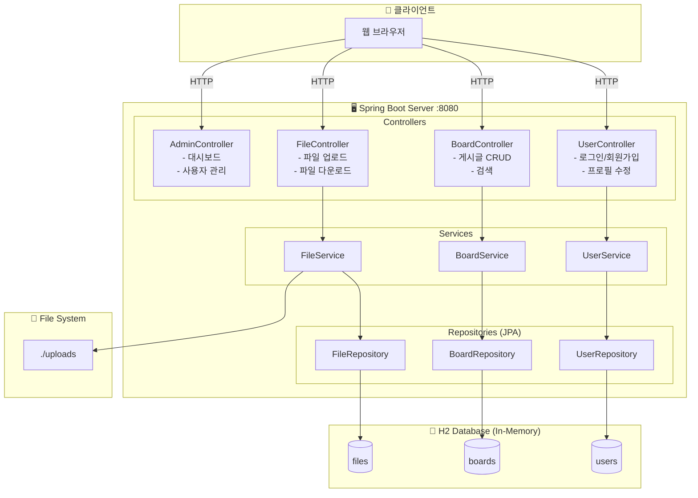
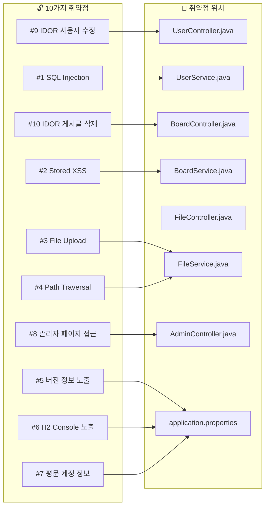
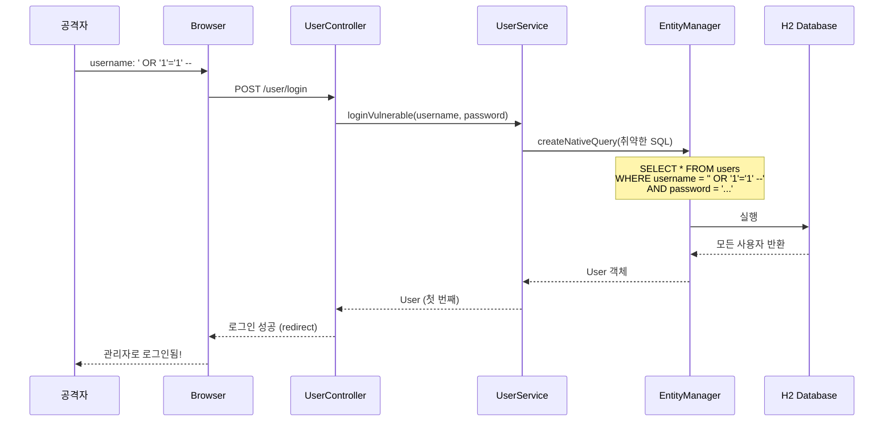
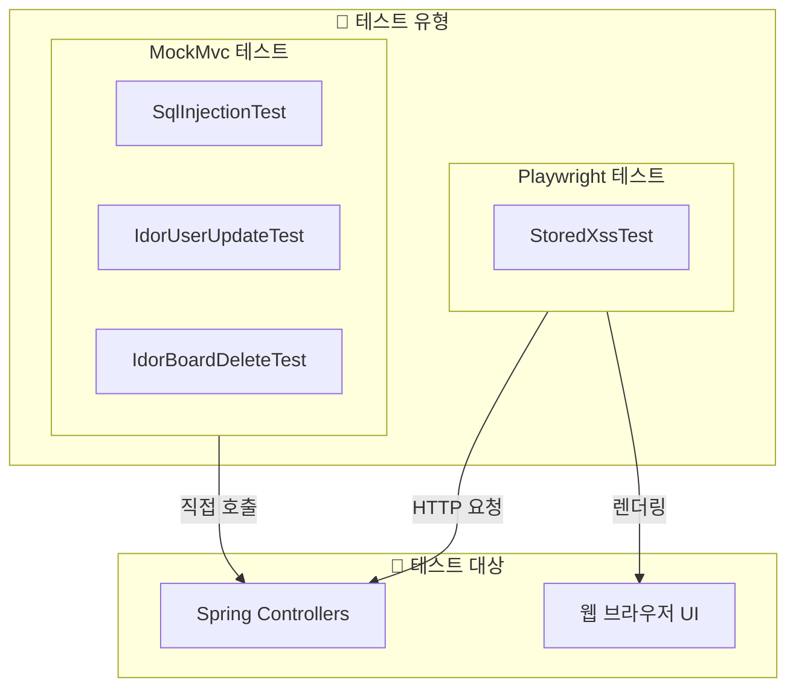

# Vulsite 아키텍처 다이어그램

## 1. 전체 시스템 아키텍처



## 2. 취약점 매핑 아키텍처



## 3. 데이터 흐름 (SQL Injection 예시)



## 4. 테스트 아키텍처



---

## 이미지 생성 방법

### 방법 1: Mermaid Live Editor (권장)
1. https://mermaid.live 접속
2. 위 코드 복사 & 붙여넣기
3. PNG/SVG 다운로드

### 방법 2: VS Code 확장
1. "Markdown Preview Mermaid Support" 설치
2. 이 파일 열기 → 미리보기

### 방법 3: GitHub
- GitHub에서 이 파일을 보면 자동 렌더링됨

### 방법 4: 명령줄
```bash
npm install -g @mermaid-js/mermaid-cli
mmdc -i architecture.md -o architecture.png
```
